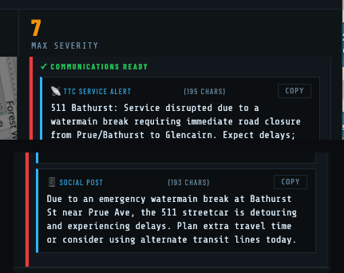
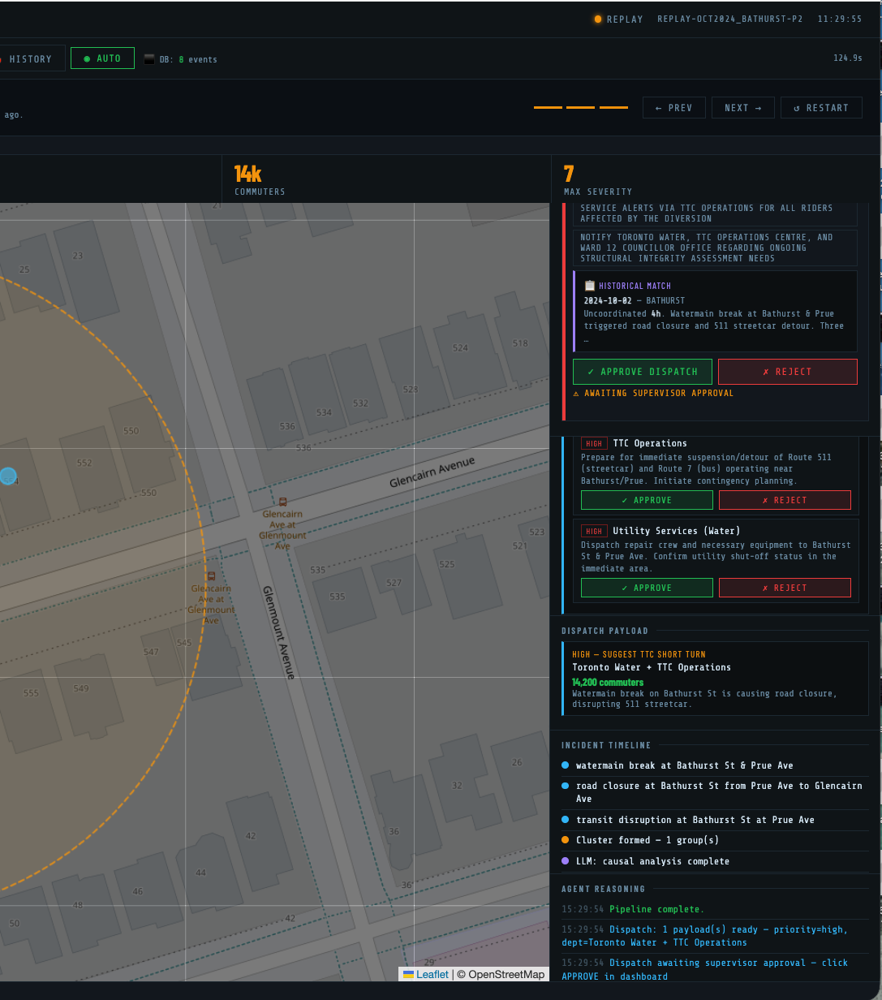

# StreetSense

**Real-time cascade detection for Toronto city operations.**

StreetSense monitors live feeds from Toronto's 311 system, road restrictions database, TTC alerts, and utility-cut permits. When a watermain breaks and the downstream road closure and streetcar diversion aren't linked in any city system, StreetSense detects the cascade, writes an operational brief, and routes it to a supervisor for one-click approval — before multiple departments start calling each other.


---

## What it does

- **Ingest** — pulls from 4 live Toronto feeds every 2 minutes (311 service requests, road restrictions, TTC GTFS-RT, utility cuts)
- **Predict** — when a watermain break or flood is ingested, immediately predicts which routes and intersections are at risk before the cascade has formed
- **Cluster** — groups spatially and temporally nearby events (300 m / 1 hour window)
- **Correlate** — LLM determines whether the cluster is causally related (e.g. watermain → road closure → TTC diversion); falls back to a deterministic heuristic if the LLM is unavailable
- **Brief** — generates an operational brief with severity score, recommended actions, and historical pattern context
- **Dispatch** — routes high-severity briefs to a supervisor HITL panel; approved dispatches fire a Slack webhook

Once a dispatch is approved, StreetSense doesn't stop at an internal recommendation, it drafts the actual outbound comms:



---

## Demo — 30 seconds

The primary demo scenario (`oct2024_bathurst`) replays a real October 2024 event: a Bathurst St watermain break cascaded into a road closure and 511 streetcar diversion across three city departments with no coordination.

By the final phase, the pipeline has scored the incident's severity and matched it against a real historical precedent:



```bash
# Start the dashboard
/usr/local/bin/python3.14 dashboard/app.py

# In a browser: http://localhost:5001
# Click "Load Demo" → select oct2024_bathurst
# Step through phases to watch the cascade build
```

Or run it headless:

```bash
/usr/local/bin/python3.14 -m evals.replay oct2024_bathurst
```

---

## Quick start — Claude API (any machine, no GPU)

No local GPU required. The pipeline routes all LLM calls to Claude automatically when an Anthropic key is present.

```bash
git clone <repo-url> && cd streetsense
python3 -m venv .venv && source .venv/bin/activate
pip install -r requirements.txt
pip install anthropic

python3 -m scripts.download_gtfs   # downloads TTC route/stop data (~5MB, one-time)

cp .env.example .env
# Edit .env — uncomment ANTHROPIC_API_KEY and set your key

/usr/local/bin/python3.14 dashboard/app.py
# Open http://localhost:5001
```

**Model:** defaults to `claude-haiku-4-5-20251001`. Override with `CLAUDE_MODEL=claude-sonnet-4-6`.

---

## Quick start — Local Ollama (GPU recommended)

Requires [Ollama](https://ollama.com) running locally. CPU works but is slow (~30–55 s/call on M-series Mac).

```bash
ollama pull gemma4:latest          # or mistral-nemo:latest for better quality

git clone <repo-url> && cd streetsense
python3 -m venv .venv && source .venv/bin/activate
pip install -r requirements.txt

cp .env.example .env
# Edit .env — set STREETSENSE_MODEL to your pulled model

/usr/local/bin/python3.14 dashboard/app.py
# Open http://localhost:5001
```

**Other providers:** set `OPENAI_API_KEY` (requires `pip install openai`) or `GOOGLE_API_KEY` (requires `pip install google-generativeai`). See `.env.example` for all options.

---

## Running the demo scenarios

```bash
# Interactive dashboard demo (recommended)
/usr/local/bin/python3.14 dashboard/app.py
# → Load Demo → oct2024_bathurst

# Headless replay
/usr/local/bin/python3.14 -m evals.replay oct2024_bathurst

# Single live pipeline run from SQLite
/usr/local/bin/python3.14 main.py --mode db

# Continuous daemon (live Toronto feeds, 2-minute interval)
/usr/local/bin/python3.14 main.py --watch --interval 120

# Seed the local database from live Toronto feeds
/usr/local/bin/python3.14 -m scripts.seed_db
```

---

## Architecture

```
Toronto APIs / SQLite DB
        |
  ingest_node      — fetches + normalises UnifiedEvents from 4 feeds
        |
  prediction_node  — for each watermain_break/flooding: PredictedCascade + DispatchRecommendation
        |
  cluster_node     — groups spatially/temporally nearby events → ClusterCandidates
        |
  correlate_node   — LLM: "are these causally related?" → CorrelationResult
                     falls back to deterministic heuristic if LLM unavailable
        |
  impact_node      — severity score + LLM for duration/actions → ImpactAssessment
        |
  brief_node       — LLM: writes operational brief → OperationalBrief
        |
  dispatch_node    — DispatchPayload for supervisor HITL (severity >= 4 only)
```

State flows immutably through `state/graph.py:run_pipeline()`. Each node receives a `PipelineState` and returns a new copy — no shared mutation. All LLM calls use `tools/llm_tools.py:call_llm_json()` and every agent has a deterministic fallback, so the pipeline never raises even if the LLM is down.

---

## Data sources

| Feed | Source | Licence |
|---|---|---|
| 311 service requests | [Toronto Open Data](https://open.toronto.ca/dataset/311-service-requests-customer-initiated/) | Open Government Licence – Toronto |
| Road restrictions | [Toronto Open Data](https://open.toronto.ca/dataset/road-restrictions/) | Open Government Licence – Toronto |
| TTC alerts | TTC GTFS-RT feed | Public |
| Utility cuts | [Toronto Open Data](https://open.toronto.ca/dataset/street-permits/) | Open Government Licence – Toronto |

This project uses data made available under the [Open Government Licence – Toronto](https://open.toronto.ca/open-data-licence/).

---

## Development

```bash
# Full test suite (417 tests, ~2.5 min)
/usr/local/bin/python3.14 -m pytest tests/ -q --tb=short

# Single file
/usr/local/bin/python3.14 -m pytest tests/agents/test_correlation_agent.py -v --tb=short

# LLM-as-Judge quality evals (hits real Ollama, run deliberately)
/usr/local/bin/python3.14 -m evals.replay oct2024_bathurst
```

Tests mock all LLM calls — the suite runs entirely offline in ~2.5 minutes. See `CLAUDE.md` for full architecture notes and `tests/conftest.py` for shared fixtures.
